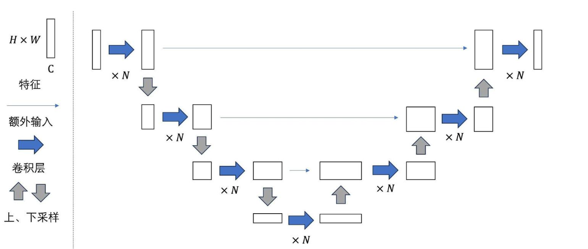
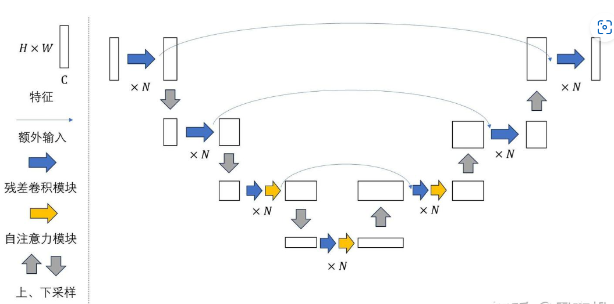
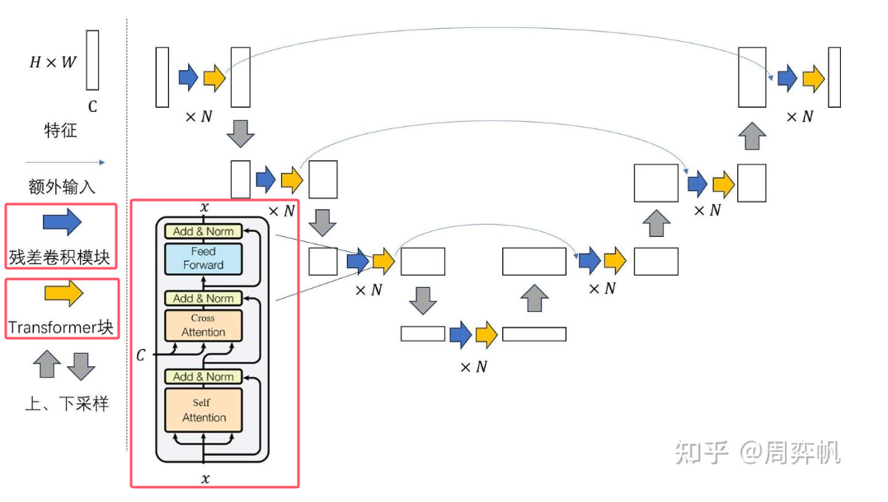
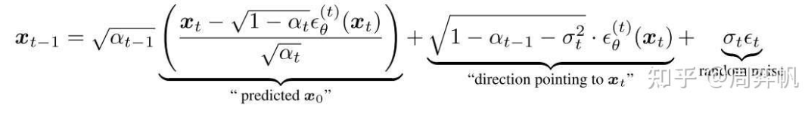
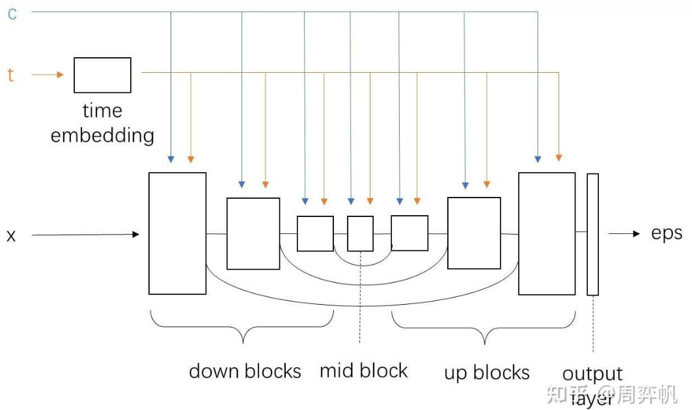
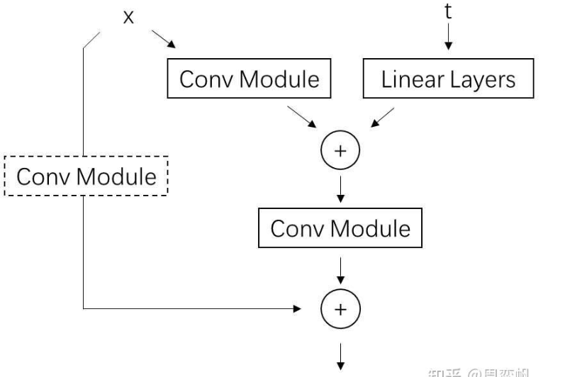
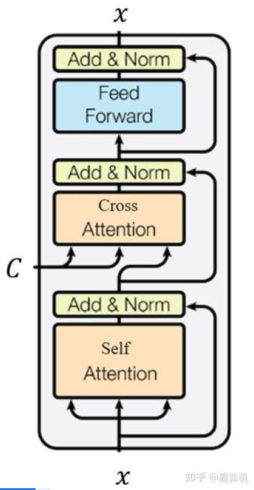

# LDM源码学习

*主要涉及采样算法和U-Net的代码，而不含有关训练、VAE、text encoder（CLIP）的代码*

*前备知识：DDPM、ResNet、U-Net、Transformer*

算法梳理思想是：主动去找一个算法对应哪一段代码，而不是去被动地理解每一行代码在干什么

## 1.[采样算法]从DDPM开始还原Latent Diffusion Model (LDM)的采样算法

```
# 逆扩散过程的采样算法
def ddpm_sample(image_shape):
    # DDPMScheduler这个类专门维护扩散模型的\alpha、\beta等变量
    ddpm_scheduler = DDPMScheduler()
    # UNet网络是denoise模型，用于预测出加在图上的噪音eps
    unet = UNet()
    # randn从标准正态分布中采样一个与image_shape大小一致的纯噪声图
    # 是生成图像的最原始噪音图xt，从它开始生成图片
    xt = randn(image_shape)
    # denoise的步数
    T = 1000
    for t in T:
        # 在每一轮的去噪t步下，unet预测出该时刻t下加的噪音
    	eps = unet(xt, t)
        # 直接从DDPM调度类中获取下一时刻t+1的方差，均值可以从xt，eps中求的
    	std = ddpm_scheduler.get_std(t)
        # 根据公式采样下一个时刻的图像，再进行去噪
    	xt = ddpm_scheduler.get_xt_prev(xt, t, eps, std)
    # 反复去噪，xt会从纯噪声图像变成一副有意义的图片
  	return xt
```

**从DDPM到DDIM**：改进1）去噪的有效步数可以少于T步，由另一个变量`ddim_steps`决定；2）采样的方差大小可以由`eta`决定；因此，改写的DDIM算法为：

```
def ddim_sample(image_shape, ddim_steps = 20, eta = 0):
	ddim_scheduler = DDIMScheduler()
    unet = UNet()
    xt = randn(image_shape)
    T = 1000
    # timesteps是去噪循环的执行次数，替代掉T，ddim_scheduler调度器生成所有被使用到的t序列
    # ddim_steps指定的生成的T'，从高到低生成ddim_steps个t，范围是1000以内，可能是不等间距的
    timesteps = ddim_scheduler.get_timesteps(T, ddim_steps) # [1000, 950, 900, ...]
    # 改进1)eta会被用来计算方差，一般这个值都会设成0
    for t in timesteps:
    	eps = unet(xt, t)
        # 改进2)
    	std = ddim_scheduler.get_std(t, eta)
    	xt = ddim_scheduler.get_xt_prev(xt, t, eps, std)
    return xt
```

*DDIM是早期的加速扩散模型采样的算法，如今有许多闭DDIM更好的采样方法，但它们都保留了step和ate这两个参数；因此在使用所有采样方法时，我们可以不用关心实现细节，只关注多出来的这两个参数*

**从DDIM到LDM**：在DDIM的基础上，LDM从生成像素空间上的图像变成为**生成隐空间上的图像**；所以隐空间图像需要再做一次解码才能变回真实图像；从代码上看，使用LDM后，只需要多准备一个VAE，并对最后的隐空间图像Zt解码；

```
def ldm_ddim_sample(image_shape, ddim_steps = 20, eta = 0):
	ddim_scheduler = DDIMScheduler()
    vae = VAE()
  	unet = UNet()
  	zt = randn(image_shape) # zt表示隐空间图像，xt表示原始图像
  	T = 1000
  	timesteps = ddim_scheduler.get_timesteps(T, ddim_steps) # [1000, 950, 900, ...]
  	for t in timesteps:
    	eps = unet(zt, t)
    	std = ddim_scheduler.get_std(t, eta)
    	zt = ddim_scheduler.get_xt_prev(zt, t, eps, std)
    # 差别
  	xt = vae.decoder.decode(zt)
  	return xt
```

**使用LDM实现文生图**，本质上就是Stable Diffusion：需要给定额外的文本输入`text`；文本编码器会把文本编码成张量`c`，输入`unet`；其他地方的实现都和之前的LDM一样；

```
def ldm_text_to_image(image_shape, text, ddim_steps = 20, eta = 0):
  	ddim_scheduler = DDIMScheduler()
  	vae = VAE()
  	unet = UNet()
  	zt = randn(image_shape)
  	T = 1000
  	timesteps = ddim_scheduler.get_timesteps(T, ddim_steps) # [1000, 950, 900, ...]
	
    # 差别 文本编码
  	text_encoder = CLIP()
  	c = text_encoder.encode(text)

  	for t = timesteps:
        # denoise网络 多输入文本编码器
    	eps = unet(zt, t, c)
    	std = ddim_scheduler.get_std(t, eta)
    	zt = ddim_scheduler.get_xt_prev(zt, t, eps, std)
  	xt = vae.decoder.decode(zt)
  	return xt
```

Stable Diffusion的采样算法看上去比较复杂，但如果能够从DDPM开始把各个功能都拆开来看，理解就不会那么困难；

## 2.[去噪网络]从经典的纯卷积U-Net到Stable Diffusion中的U-Net

**最早的U-Net结构**：向下下采样3次，再向上上采样3次，所形成的网络结构与`U`类似；特点：

- 从整体上看，U-Net由若干个大层组成；特征在每一大层会被下采样成尺寸更小的特征，再被上采样回原尺寸的特征；整个网络构成一个U型结构；
- 下采样后，特征通道数会变多，一般情况下，每次下采样后图像尺寸减半，通道数翻倍，上采样过程则反之；
- 为了防止信息在下采样的过程中丢失，U-Net每一大层在下采样前的输出会作为额外输入拼接到每一大层上采样前的输入上；类似于ResNet中的[短路连接]



**DDPM使用改进后的U-Net**：主要有两点，

- 原来的卷积层被替换成了ResNet中的残差卷积模块（蓝色的箭头）；每一大层有若干个这样得到子模块；==对于**较深**的大层，残差卷积模块后面还会接一个自注意力模块==；
- 原来模型每一大层中只有一个短路连接；现在每个大层下采样部分的每个子模块的输出都会额外输入到其对称的上采样部分的子模块上；直观上来看，就是短路连接更多了一点，输入信息更不容易在下采样过程中丢失；



**LDM提出给U-Net添加额外约束信息（即文本等）的方法**：把U-Net中==自注意力模块换成交叉注意力模块，不只是深层加注意力，上层也加因为要加入文本约束，自注意和交叉注意力都有==；具体来说，DDPM的U-Net的自注意力模块换成了标准的Transformer模块（再具体来说是decoder）；约束信息C可以作为Cross Attention的K,V输入进模块；

**Stable Diffusion的U-Net还在结构上有少许修改**：该U-Net的每一大层都有Transfomer块，而不是只有较深的大层有：



## 3.[核心代码]`scripts/txt2img.py`

*为了方便阅读，我们可以简化代码中的命令处理，得到精简代码*

**main()**：抛开前面一大堆初始化操作，代码的核心只有一下几行：

*`Classifier-Free Guidance (CFG)`*：一种在扩散模型中用于提高生成样本质量和可控性得到技术,它通过在无条件和有条件之间进行插值来实现对生成过程的精细控制
*工作原理*：在去噪过程中，CFG结合无条件和有条件两种去噪过程（即加权两种去噪的denoise网络输出）
$$
\epsilon_\theta(z_t,t, c, \phi) = (1 + w)\epsilon_\theta(z_t, t, c)\ -w\epsilon_\theta(z_t, t, \phi)\\
where \ w是引导尺度(guidance\ scale), c是条件信息,\phi是无条件输入(通常是空文本或负提示)\\
引导尺度w越大，生成内容越接近条件信息，但样本多样性可能会降低，并可能出现不自然的细节或伪影
$$

*改进*：CFG++ 是对 CFG 的一种改进，通过在去噪过程中使用无条件噪声进行重噪声处理，从而减少与自然图像流形的偏差，提高样本质量和生成稳定性。CFG++ 在高引导尺度下表现尤为出色，能够生成更高质量的样本。

```
# 开始的几行是在执行Classifier-Free Guidance (CFG)
# uc表示的是CFG中的无约束下的约束张量
# scale表示的是执行CFG的程度，即引导尺度
uc = None
if opt.scale != 1.0: # 表示当引导尺度不为1时,启用CFG,设置无条件变量为batch_size个空字符串
    # get_learned_conditioning表示使用CLIP把输入文本变成张量c
	uc = model.get_learned_conditioning(batch_size * [""])
    
if isinstance(prompts, tuple):
	prompts = list(prompts) # 转为list
c = model.get_learned_conditioning(prompts) # get_learned_conditioning转张量
shape = [opt.C, opt.H // opt.f, opt.W // opt.f]
# 使用扩散模型的采样器生成图片
# sampler是DDIM采样器
# sampler.sample函数直接完成了图像生成
samples, _ = sampler.sample(S=opt.steps,
							conditioning=c,
							batch_size=opt.n_samples,
							shape=shape,
							verbose=False,
							unconditional_guidance_scale=opt.scale,
							unconditional_conditioning=uc,
							eta=opt.ddim_eta,
							x_T=start_code)
# 最后LDM生成的隐空间图片被VAE解码成真实图片
# 即decode_first_stage负责将图片解码
# x_samples后续会被处理成正确的RGB图片，并输出至文件里
x_samples = model.decode_first_stage(samples)
```

*源代码是有点凌乱的，采样算法的一部分被仍到了主函数里，另一部分被放到了DDIM采样器里，都要阅读；*

## 4.[核心代码]DDIM采样器

```
    if opt.plms:
        sampler = PLMSSampler(model, device=device)
    elif opt.dpm:
        sampler = DPMSolverSampler(model, device=device)
    else:
        sampler = DDIMSampler(model, device=device)
```

及转到对应`py`文件：

```
from ldm.models.diffusion.ddim import DDIMSampler
from ldm.models.diffusion.plms import PLMSSampler
from ldm.models.diffusion.dpm_solver import DPMSolverSampler
```

首先，先看这个类的构造函数，主要是将U-Net mode 给保存了下来，后文的`self.model`都指的是U-Net

```
    def __init__(self, model, schedule="linear", device=torch.device("cuda"), **kwargs):
        super().__init__()
        self.model = model
        self.ddpm_num_timesteps = model.num_timesteps
        self.schedule = schedule
        self.device = device
        
# 对应会main函数里
	config = OmegaConf.load(f"{opt.config}")
    device = torch.device("cuda") if opt.device == "cuda" else torch.device("cpu")
    # model 扩散模型的模型，要加载余训练权重，opt.ckpt预训练参数的地址
    model = load_model_from_config(config, f"{opt.ckpt}", device)

    # 把模型传进去，获得U-net(去噪网络)
    if opt.plms:
        sampler = PLMSSampler(model, device=device)
    elif opt.dpm:
        sampler = DPMSolverSampler(model, device=device)
    else:
        sampler = DDIMSampler(model, device=device)
```

然后继续看这个类最重要的`self.sample`方法，主要是看逻辑：

```
# sample方法传入一大堆的参数，再进行了一些条件判断和初始化
# make_schedule用于预处理扩散模型的中间计算参数，DDIM用到的有效时间戳列表就是在这个函数里设置，
# 该列表通过make_ddim_timesteps获取，并保存在self.ddim_timesteps中。此外，由ddim_eta决定的扩散模型的方差也是在这个方法里设置的(其实还是设置ddim_timesteps和eta)
self.make_schedule(ddim_num_steps=S, ddim_eta=eta, verbose=verbose)
# sampling
C, H, W = shape
size = (batch_size, C, H, W)
# 这个方法其实就执行了一个self.make_schedule,又将许多参数传入self.ddim_sampling方法
samples, intermediates = self.ddim_sampling(...)
# 最后返回
return samples, intermediates
```

最后通道嵌套，来到了DDIM采样算法的实现方法`self.ddim_sampling`：*从第一节的伪代码入手，对应最基础的伪代码框架*

*tqdm是一个在python中广泛使用的进度条库，用于在命令行界面(CLI)或jupyter notebook中显示任务的进度;*

*在DDPM论文中，扩散模型的**前向过程用字母q**表示，**反向过程用字母p**表示。因此，反向过程的一轮去噪在代码里被叫做`p_sample`*

```
    def ddim_sampling(self, ...):
        if timesteps is None:
            timesteps = self.ddpm_num_timesteps if ddim_use_original_steps else self.ddim_timesteps
        elif timesteps is not None and not ddim_use_original_steps:
            subset_end = int(min(timesteps / self.ddim_timesteps.shape[0], 1) * self.ddim_timesteps.shape[0]) - 1
            timesteps = self.ddim_timesteps[:subset_end]

        intermediates = {'x_inter': [img], 'pred_x0': [img]}
        time_range = reversed(range(0,timesteps)) if ddim_use_original_steps else np.flip(timesteps)
        total_steps = timesteps if ddim_use_original_steps else timesteps.shape[0]
        print(f"Running DDIM Sampling with {total_steps} timesteps")

        iterator = tqdm(time_range, desc='DDIM Sampler', total=total_steps)
        
		# 将ddim_timesteps预处理为iterator，该变量用于控制DDIM去噪循环
        for i, step in enumerate(iterator):
            # 对于一个时间step（一个变量或者张量）创建一个内容全为step，形状为(b,)的张量ts
            index = total_steps - i - 1
            ts = torch.full((b,), step, device=device, dtype=torch.long)

            if mask is not None:
                assert x0 is not None
                img_orig = self.model.q_sample(x0, ts)  # TODO: deterministic forward pass?
                img = img_orig * mask + (1. - mask) * img

            if ucg_schedule is not None:
                assert len(ucg_schedule) == len(time_range)
                unconditional_guidance_scale = ucg_schedule[i]
                
				# p_sample_ddim进行一次去噪过程，传入ts张量和当前隐空间图像img、约束信息张量cond
            	# p_sample_ddim返回下一步要去噪的图像，进行下一轮去噪
            	outs = self.p_sample_ddim(...)
            	img, pred_x0 = outs
            	if callback: callback(i)
            	if img_callback: img_callback(pred_x0, i)

            	if index % log_every_t == 0 or index == total_steps - 1:
                	intermediates['x_inter'].append(img)
                	intermediates['pred_x0'].append(pred_x0)
		# 经过多次去噪，返回去噪后的隐空间图像img
        return img, intermediates
```

最后再看一下`p_sample_ddim`的主体代码：

```
    def p_sample_ddim(self, ...):
        b, *_, device = *x.shape, x.device
		# 1) 调用U-Net self.model使用CFG来计算这一轮去掉的噪声e_t
        # 不启用CFG时，方法直接通过self.model.apply_model(x, t, c)调用U-Net，算出这一轮的噪声e_t。而想启用CFG，需要输入空字符串的约束张量unconditional_conditioning，且CFG的强度unconditional_guidance_scale不为1。CFG的执行过程是：对U-Net输入不同的约束c，先用空字符串约束得到一个预测噪声e_t_uncond，再用输入的文本约束得到一个预测噪声e_t。之后令e_t = et_uncond + scale * (e_t - e_t_uncond)。scale大于1，即表明我们希望预测噪声更加靠近有输入文本的那一个。直观上来看，scale越大，最后生成的图片越符合输入文本，越偏离空文本。下面这段代码正是实现了上述这段逻辑，只不过代码使用了一些数据拼接技巧，让空字符串约束下和输入文本约束下的结果在一次U-Net推理中获得。
        if unconditional_conditioning is None or unconditional_guidance_scale == 1.:
            model_output = self.model.apply_model(x, t, c)
        else:
            x_in = torch.cat([x] * 2)
            ...
            model_uncond, model_t = self.model.apply_model(x_in, t_in, c_in).chunk(2)
            model_output = model_uncond + unconditional_guidance_scale * (model_t - model_uncond)

        if self.model.parameterization == "v":
            e_t = self.model.predict_eps_from_z_and_v(x, t, model_output)
        else:
            e_t = model_output

        if score_corrector is not None:
            assert self.model.parameterization == "eps", 'not implemented'
            e_t = score_corrector.modify_score(self.model, e_t, x, t, c, **corrector_kwargs)

        alphas = self.model.alphas_cumprod if use_original_steps else self.ddim_alphas
        alphas_prev = self.model.alphas_cumprod_prev if use_original_steps else self.ddim_alphas_prev
        sqrt_one_minus_alphas = self.model.sqrt_one_minus_alphas_cumprod if use_original_steps else self.ddim_sqrt_one_minus_alphas
        sigmas = self.model.ddim_sigmas_for_original_num_steps if use_original_steps else self.ddim_sigmas
        # 2) 预处理出DDIM的中间变量
        # select parameters corresponding to the currently considered timestep
        a_t = torch.full((b, 1, 1, 1), alphas[index], device=device)
        a_prev = torch.full((b, 1, 1, 1), alphas_prev[index], device=device)
        sigma_t = torch.full((b, 1, 1, 1), sigmas[index], device=device)
        sqrt_one_minus_at = torch.full((b, 1, 1, 1), sqrt_one_minus_alphas[index],device=device)

        # current prediction for x_0
        if self.model.parameterization != "v":
            pred_x0 = (x - sqrt_one_minus_at * e_t) / a_t.sqrt()
        else:
            pred_x0 = self.model.predict_start_from_z_and_v(x, t, model_output)

        if quantize_denoised:
            pred_x0, _, *_ = self.model.first_stage_model.quantize(pred_x0)

        if dynamic_threshold is not None:
            raise NotImplementedError()
		# 3) 最后根据DDIM的公式，计算出这一轮去噪之后的额图片x_prev
        # direction pointing to x_t
        dir_xt = (1. - a_prev - sigma_t**2).sqrt() * e_t
        noise = sigma_t * noise_like(x.shape, device, repeat_noise) * temperature
        if noise_dropout > 0.:
            noise = torch.nn.functional.dropout(noise, p=noise_dropout)
        x_prev = a_prev.sqrt() * pred_x0 + dir_xt + noise
        return x_prev, pred_x0
```



该方法可以实现一步去噪操作。多次调用该方法去噪后，我们就能得到生成的隐空间图片。该图片会被返回到main函数里，被VAE的解码器解码成普通图片。至此，我们就学完了Stable Diffusion官方仓库的采样代码。

最后，我们再对照之前写的伪代码，梳理一下官方仓库代码的逻辑：*官方仓库的采样代码一部分在`main()`函数里，另一部分在对应的`py`文件里；其中，`main`函数主要完成了编码约束文字、解码隐空间图像这两件事；剩下的DDIM采样以及各种DIffusion图像编辑功能都在对应`py`文件中实现；

*在学习代码时，要着重学习DDIM采样器部分的代码；大部分基于Diffusion的图像编辑技术都是在DDIM采样的中间步骤做文章；除此之外，与LDM相关的文字约束编码、隐空间图像编辑解码的接口函数也需要熟悉，不少技术会调用到这几项功能*

## 5.[核心代码]U-Net

*再来看一下main函数和DDIM采样中U-Net的调用逻辑*

**在main.py里**：LDM模型类model在主函数中通过`load_model_from_config`从配置文件里创建，随后成为了`sampler`的成员变量（所以model还是指的DDPM）；在DDIM去噪循环中，LDM模型里的U-Net会在`self.model.apply.model`方法里被调用；

```
# main.py
config = 'configs/stable-diffusion/v1-inference.yaml'
config = OmegaConf.load(config)
model = load_model_from_config(config, ckpt)
sampler = DDIMSampler(model)

# ldm/models/diffusion/ddim.py
e_t = self.model.apply_model(x, t, c)
```

**查看配置文件**：可以知道model和U-net的类位置

```
model:
  base_learning_rate: 1.0e-4
  target: ldm.models.diffusion.ddpm.LatentDiffusion
  params:
    ...

    unet_config:
      target: ldm.modules.diffusionmodules.openaimodel.UNetModel
      ...
```

****

**ldm.models.diffusion.ddpm.LatentDiffusion**：ldm\models\diffusion\ddpm.py原本来自DDPM论文的官方仓库，内含DDPM类的实现；DDPM类维护了扩散模型公式里的一些变量，同时维护了U-Net类的实例；LDM的作者基于之前DDPM的代码进行开发，定义了一个继承自DDPM的LatentDiffusion类；==但除了DDPM本身的功能之外，LatentDiffusion还维护了VAE(主要到隐空间的编码和解码)（`self.first_stage_model`）,CLIP(`self.cond_stage_model`)（主要是对文本进行编码）==；也就是说，`LatentDiffusion`主要维护了扩散模型中间变量、U-Net、VAE、CLIP这四类信息。这样，所有带参数的模型都在`LatentDiffusion`里，我们可以从一个checkpoint文件中读取所有的模型的参数。相关代码定义代码如下：

*把所有模型定义在一起有好处也有坏处。好处在于，用户想使用Stable Diffusion时，只需要下载一个checkpoint文件就行了。坏处在于，哪怕用户只改了某个子模型（如U-Net），为了保存整个模型，他还是得把其他子模型一起存下来。这其中存在着信息冗余，十分不灵活。Diffusers框架没有把模型全存在一个文件里，而是放到了一个文件夹里。*

```
class DDPM(pl.LightningModule):
    # classic DDPM with Gaussian diffusion, in image space
    def __init__(self,
                 unet_config,
                 ...
                 ):
        super().__init__()
        self.model = DiffusionWrapper(unet_config, conditioning_key)

def __init__(self,
                 first_stage_config,
                 cond_stage_config,
             ...
            ):
    self.instantiate_first_stage(first_stage_config)
    self.instantiate_cond_stage(cond_stage_config)
```

**`LatentDiffusion`类的`apply_model`方法**：该方法用于调用U-Net

```
    def apply_model(self, x_noisy, t, cond, return_ids=False):
        # 一开始对输入的约束信息编码cond做了一个前处理，判断约束是哪种类型
        # 这里支持'concat' else 'c_crossattn'两种，即将约束与输入拼接、将约束注入到交叉注意力层中
        if isinstance(cond, dict):
            # hybrid case, cond is expected to be a dict
            pass
        else:
            if not isinstance(cond, list):
                cond = [cond]
            key = 'c_concat' if self.model.conditioning_key == 'concat' else 'c_crossattn'
            cond = {key: cond}
		# 然后交给U-net(self.model??)处理，
        x_recon = self.model(x_noisy, t, **cond)

        if isinstance(x_recon, tuple) and not return_ids:
            return x_recon[0]
        else:
            return x_recon
```

**ldm/modules/diffusionmodules/openaimodel.py**：UNetModel类只定义了神经网络层的运算，没有多余的功能，首先看forward方法：*x, timesteps=None, context=None分别表示当前去噪时刻的图片、当前时间戳、文本约束编码（文本的编码），根据这些输入，forward会输出当前时刻应去除的噪声eps*

```
    def forward(self, x, timesteps=None, context=None, y=None,**kwargs):
        assert (y is not None) == (
            self.num_classes is not None
        ), "must specify y if and only if the model is class-conditional"
        hs = []
        # timestep_embedding来自Transformer论文中介绍的位置编码timestep_embedding
        # 得到t的编码t_emb
        t_emb = timestep_embedding(timesteps, self.model_channels, repeat_only=False)
        # t_emb再经过几个线性层得到最终的时间步编码emb;context是已经被CLIP处理过的编码，不需要额外做处理
        emb = self.time_embed(t_emb)

        if self.num_classes is not None:
            assert y.shape[0] == x.shape[0]
            emb = emb + self.label_emb(y)

        h = x.type(self.dtype)
        # input_blocks是下采样模块
        for module in self.input_blocks:
            # emb、context注入到U-Net的所有中间模块中
            h = module(h, emb, context)
            hs.append(h) # 每一个子module的临时输出都会被保存进hs栈中
        # 中间结果h进入middle_block中间模块
        h = self.middle_block(h, emb, context)
        # output_blocks是上采样模块
        for module in self.output_blocks:
            # th.cat([h, hs.pop()], dim=1)是恢复下采样中的信息损失，拼接到一起输入进入子模块中
            h = th.cat([h, hs.pop()], dim=1)
            h = module(h, emb, context)
        h = h.type(x.dtype)
        if self.predict_codebook_ids:
            return self.id_predictor(h)
        else:
            # 最后，h会被输出层转换成一个通道数正确的eps张量--预测的噪音
            return self.out(h)
```



在阅读`__init__`前，我们先看一下待会会用到的另一个模块类`TimestepEmbedSequential`的定义：

*在pytorch中，一系列输入和输出都只有一个变量的模块在串行连接时，可以用串行模块类`nn.Sequential`来把多个模块合并简化成一个模块；而在扩散模型中，多数模块的输入是x，t，c三个变量，输出是一个变量；为了也能用类似的串行模块类把扩散模型的模块合并在一起，代码中包含了一个`TimestepEmbedSequential`，==它的行为类似于`nn.Sequential`==，只不过它支持x、t、c的输入；forward中的用到的多数模块都是通过这个类创建的；*

```
class TimestepEmbedSequential(nn.Sequential, TimestepBlock):
    """
    A sequential module that passes timestep embeddings to the children that
    support it as an extra input.
    """

    def forward(self, x, emb, context=None):
        for layer in self:
            if isinstance(layer, TimestepBlock):
                x = layer(x, emb)
            elif isinstance(layer, SpatialTransformer):
                x = layer(x, context)
            else:
                x = layer(x)
        return x
```

**`__init__`方法代码**：真的很长，在阅读这样的代码时，不需要每一行都去细度，只需要理解代码能拆成几块，每一块在做什么即可：

```
class UNetModel(nn.Module):
    def __init__(self, ...):

        self.time_embed = ...

        self.input_blocks = nn.ModuleList(...)
        for level, mult in enumerate(channel_mult):
            ...

        self.middle_block = ...

        self.output_blocks = nn.ModuleList([])
        for level, mult in list(enumerate(channel_mult))[::-1]:
            ...
    	self.out = ...
```

1）`time_embed`：在上面的`forward`方法里对t_step先被正弦编码timestep_embedding编码成一个张量；之后再被time_embed用于进一步提取时间戳编码的特征，由下面的代码可知，它本质就是一个由两个普通线性层构成的模块；

```
self.time_embed = nn.Sequential(
            linear(model_channels, time_embed_dim),
            nn.SiLU(),
            linear(time_embed_dim, time_embed_dim),
        )
```

2）在看U-Net最后面的输出模块out：也比较简单，主要包含了一个卷积层，用于把中间变量的通道数从dims变成model_channels；

```
self.out = nn.Sequential(
            normalization(ch),
            nn.SiLU(),
            zero_module(conv_nd(dims, model_channels, out_channels, 3, padding=1)),
        )
```

3）再聚焦于U-Net的三个核心模块上：`input_blocks`, `middle_block`, `output_blocks`，这三个模块的组成都很类似，都用到了残差块`ResBlock`和注意力块；稍有不同的是，`input_block`的每一大层后面都有一个下采样模块，`output_block`的每一大层后面都有一个上采样模块；上下采样模块的结构都和常规，与经典的U-Net无异，所以我们把学习的重点放在残差块和注意力块，思路是先看这个两个模块的内部实现细节，再来看它们是怎么拼接起来的；

**`ResBlock`**：和原DDPM的U-Net的ResBlock功能完全一样，都是在普通残差块的基础上，支持时间戳编码的额外输入；具体来说，普通的残差块是由两个卷积模块和一条短路连接构成的，即`y = x + conv(conv((x)))`；如果经过两个卷积块后数据的通道数发生了变化，则要在短路连接上加上一个转换通道的卷积即`y = conv(x) + conv(conv(x))`;
而为了把`t`和输入`x`的信息融合起来，t会和经过第一个卷积后的中间结果`conv(x)`加在一起，但是两者的通道数不同的话就不能直接相加；为此，每一个残差块中都有一个用于转换t通道数的线性层，这样就能实现相加，整个模块就可以表示成`y = conv(x) + conv(conv(x) + linear(t))`，图示如下：



```
class ResBlock(TimestepBlock):
    def __init__(
        self,
        ...
    ):
        super().__init__()
        ...
        # in_layers 是第一个卷积模块
        self.in_layers = nn.Sequential(
            normalization(channels),
            nn.SiLU(),
            conv_nd(dims, channels, self.out_channels, 3, padding=1),
        )

        self.updown = up or down
		...
        # emb_layers是调整时间戳编码通道得到线性层模块
        self.emb_layers = nn.Sequential(
            nn.SiLU(),
            linear(
                emb_channels,
                2 * self.out_channels if use_scale_shift_norm else self.out_channels,
            ),
        )
        # out_layers是第二个卷积模块
        self.out_layers = nn.Sequential(
            normalization(self.out_channels),
            nn.SiLU(),
            nn.Dropout(p=dropout),
            zero_module(
                conv_nd(dims, self.out_channels, self.out_channels, 3, padding=1)
            ),
        )

        if self.out_channels == channels:
            self.skip_connection = nn.Identity() # skip_connection使用于调整短路连接通道数的模块；如果输入输出通道相同，则该模块式一个恒等函数，不对数据做任何修改；否则修改通道数；
        elif use_conv:
            self.skip_connection = conv_nd(
                dims, channels, self.out_channels, 3, padding=1
            )
        else:
            self.skip_connection = conv_nd(dims, channels, self.out_channels, 1)

    def forward(self, x, emb):
        return checkpoint(
            self._forward, (x, emb), self.parameters(), self.use_checkpoint
        )

	# 着重看forward方法
    # 输入x先经过第一个卷积模块in_layers，再与经过emb_layers的时间戳相加
    # 再进入第二个卷积层out_layers；最后输出与原输入skip_connection(x)加在一起，作为整个残差块的输出
    def _forward(self, x, emb):
        if self.updown:
            in_rest, in_conv = self.in_layers[:-1], self.in_layers[-1]
            h = in_rest(x)
            h = self.h_upd(h)
            x = self.x_upd(x)
            h = in_conv(h)
        else:
            h = self.in_layers(x)
        # emb_out的形状是[n,c]，需要把形状变成[n, c, 1, 1]
        # 在与h([n, c, h, w]) emb_out做加法时，会被自动广播成[n, c, h, w]
        emb_out = self.emb_layers(emb).type(h.dtype)
        
        while len(emb_out.shape) < len(h.shape):
            # 即这句就是为emb_out数据最后加一个长度为1的维度
            emb_out = emb_out[..., None]
            
        if self.use_scale_shift_norm:
            out_norm, out_rest = self.out_layers[0], self.out_layers[1:]
            scale, shift = th.chunk(emb_out, 2, dim=1)
            h = out_norm(h) * (1 + scale) + shift
            h = out_rest(h)
        else:
            h = h + emb_out
            h = self.out_layers(h)
            
        return self.skip_connection(x) + h
```

**注意力模块**：在U-Net中被创建的代码：

```
# 用于控制在U-Net的哪些层？
if not exists(num_attention_blocks) or nr < num_attention_blocks[level]:
	layers.append(
		AttentionBlock(
        	ch,
            use_checkpoint=use_checkpoint,
            num_heads=num_heads,
            num_head_channels=dim_head,
            use_new_attention_order=use_new_attention_order,
            ) 
        	# 根据use_spatial_transformer这个变量来决定创建什么注意力模块
        	# AttentionBlock是DDPM采用的普通自注意力模块
        	# SpatialTransformer是LDM提出来得到支持额外约束的标准Transfomer块
        	# Stable Diffusion使用的是SpatialTransformer，主要看这部分
        	if not use_spatial_transformer else SpatialTransformer(
                                ch, num_heads, dim_head, depth=transformer_depth, 									context_dim=context_dim,
                                disable_self_attn=disabled_sa, 					  									use_linear=use_linear_in_transformer,
                                use_checkpoint=use_checkpoint
                            )
                        )
```

标准的Transformer块，输入x先经过一个注意力层，再经过一个交叉注意力层，在此期间，约束编码c会作为交叉注意力层的K，V输入进入模块；最后数据经过一个全连接层；每一层的输入都会和输出做一个残差连接；
当然标准的Transformer是针对一维序列数据的，要把Transformer用到图像上，则需要把图像的高宽拼接到同一维，即对张量做形状变换`[n, c, h, w] -> [n, c, (h * w)]`，做完这个变换后，就可以把数据直接输入进Transformer模块了；这些图像数据与序列数据的适配都是在`SpatialTransformer`类里完成的，但并没有直接实现Transformer块的细节，仅仅是U-Net和Transformer块之间的一个过渡，`SpatialTransformer`的`transformer_blocks`才是真正的Transformer模块，但还是先看看`SpatialTransformer`类的代码



```
class SpatialTransformer(nn.Module):
    # 该类中有两个卷积层proj_in和proj_out，负责图像通道数与Transfomer模块通道数之间的转换
    def __init__(self, in_channels, n_heads, d_head,
                 depth=1, dropout=0., context_dim=None,
                 disable_self_attn=False, use_linear=False,
                 use_checkpoint=True):
        super().__init__()
        if exists(context_dim) and not isinstance(context_dim, list):
            context_dim = [context_dim]
        self.in_channels = in_channels
        inner_dim = n_heads * d_head
        self.norm = Normalize(in_channels)
        # proj_in
        if not use_linear:
            self.proj_in = nn.Conv2d(in_channels,
                                     inner_dim,
                                     kernel_size=1,
                                     stride=1,
                                     padding=0)
        else:
            self.proj_in = nn.Linear(in_channels, inner_dim)
		# BasicTransformerBlock真正的Transformer模块
        self.transformer_blocks = nn.ModuleList(
            [BasicTransformerBlock(inner_dim, n_heads, d_head, dropout=dropout, context_dim=context_dim[d],
                                   disable_self_attn=disable_self_attn, checkpoint=use_checkpoint)
                for d in range(depth)]
        )
        # proj_out
        if not use_linear:
            self.proj_out = zero_module(nn.Conv2d(inner_dim,
                                                  in_channels,
                                                  kernel_size=1,
                                                  stride=1,
                                                  padding=0))
        else:
            self.proj_out = zero_module(nn.Linear(in_channels, inner_dim))
        self.use_linear = use_linear

    # 再看forward函数
    # 在forward中，图像数据在进出Transformer模块前后都会做形状和通道数上的适配。运算结束后，结果和输入之间还会做一个残差连接。context就是约束信息编码，它会接入到交叉注意力层里
    def forward(self, x, context=None):
        # note: if no context is given, cross-attention defaults to self-attention
        if not isinstance(context, list):
            context = [context]
        b, c, h, w = x.shape
        x_in = x
        # 1)
        x = self.norm(x)
        if not self.use_linear:
            x = self.proj_in(x)
        x = rearrange(x, 'b c h w -> b (h w) c').contiguous()
        if self.use_linear:
            x = self.proj_in(x)
        # 2) context接入交叉注意力层
        for i, block in enumerate(self.transformer_blocks):
            x = block(x, context=context[i])
        # 3)
        if self.use_linear:
            x = self.proj_out(x)
        x = rearrange(x, 'b (h w) c -> b c h w', h=h, w=w).contiguous()
        if not self.use_linear:
            x = self.proj_out(x)
            
        return x + x_in
```

**BasicTransformerBlock**：就是Transformer的代码

```
class BasicTransformerBlock(nn.Module):
    ATTENTION_MODES = {
        "softmax": CrossAttention,  # vanilla attention
        "softmax-xformers": MemoryEfficientCrossAttention
    }
    def __init__(self, dim, n_heads, d_head, dropout=0., context_dim=None, gated_ff=True, checkpoint=True,
                 disable_self_attn=False):
        super().__init__()
        attn_mode = "softmax-xformers" if XFORMERS_IS_AVAILBLE else "softmax"
        assert attn_mode in self.ATTENTION_MODES
        attn_cls = self.ATTENTION_MODES[attn_mode]
        self.disable_self_attn = disable_self_attn
        # attn_cls是MemoryEfficientCrossAttention或者CrossAttention，都是交叉注意力
        self.attn1 = attn_cls(query_dim=dim, heads=n_heads, dim_head=d_head, dropout=dropout,context_dim=context_dim if self.disable_self_attn else None)  # is a self-attention if not self.disable_self_attn
        self.ff = FeedForward(dim, dropout=dropout, glu=gated_ff)
        self.attn2 = attn_cls(query_dim=dim, context_dim=context_dim,
                              heads=n_heads, dim_head=d_head, dropout=dropout)  # is self-attn if context is none
        self.norm1 = nn.LayerNorm(dim)
        self.norm2 = nn.LayerNorm(dim)
        self.norm3 = nn.LayerNorm(dim)
        self.checkpoint = checkpoint

    def forward(self, x, context=None):
        return checkpoint(self._forward, (x, context), self.parameters(), self.checkpoint)

    def _forward(self, x, context=None):
        # 当forward的参数context=None时，模块其实只是一个提取特征的自注意力模块；
        # 而当context为约束文本的编码时，模块就是一个根据文本约束进行运算的交叉注意力模块。该模块用不到mask，相关的代码可以忽略。
        x = self.attn1(self.norm1(x), context=context if self.disable_self_attn else None) + x
        x = self.attn2(self.norm2(x), context=context) + x
        x = self.ff(self.norm3(x)) + x
        return x
```

**交叉注意力层**：还用不到mask

```
class CrossAttention(nn.Module):
    def __init__(self, query_dim, context_dim=None, heads=8, dim_head=64, dropout=0.):
        super().__init__()
        inner_dim = dim_head * heads
        context_dim = default(context_dim, query_dim)

        self.scale = dim_head ** -0.5
        self.heads = heads

        self.to_q = nn.Linear(query_dim, inner_dim, bias=False)
        self.to_k = nn.Linear(context_dim, inner_dim, bias=False)
        self.to_v = nn.Linear(context_dim, inner_dim, bias=False)

        self.to_out = nn.Sequential(
            nn.Linear(inner_dim, query_dim),
            nn.Dropout(dropout)
        )

    def forward(self, x, context=None, mask=None):
        h = self.heads

        q = self.to_q(x)
        context = default(context, x)
        k = self.to_k(context)
        v = self.to_v(context)

        q, k, v = map(lambda t: rearrange(t, 'b n (h d) -> (b h) n d', h=h), (q, k, v))

        # force cast to fp32 to avoid overflowing
        if _ATTN_PRECISION =="fp32":
            with torch.autocast(enabled=False, device_type = 'cuda'):
                q, k = q.float(), k.float()
                sim = einsum('b i d, b j d -> b i j', q, k) * self.scale
        else:
            sim = einsum('b i d, b j d -> b i j', q, k) * self.scale
        
        del q, k
    
        if exists(mask):
            ...

        # attention, what we cannot get enough of
        sim = sim.softmax(dim=-1)

        out = einsum('b i j, b j d -> b i d', sim, v)
        out = rearrange(out, '(b h) n d -> b n (h d)', h=h)
        return self.to_out(out)
```

**然后就可以回过头去看**：SpatialTransformer`和`ResBlock是怎么拼接的了，在U-Net中

先看中间块，就是一个ResBlock接一个SpatialTransformer，然后再接一个ResBlock

```
self.middle_block = TimestepEmbedSequential(
            ResBlock(...),
            AttentionBlock(...) if not use_spatial_transformer else SpatialTransformer(...),
            ResBlock(...))
```

而下采样块`input_blocks`和上采样块`output_blocks`的结构几乎一模一样，区别只在于每一大层最后是做下采样还是上采样。这里我们以下采样块为例来学习一下这两个块的结构：

```
self.input_blocks = nn.ModuleList(
            [	# 上采样块一开始是一个调整输入图片通道数的卷积层，它的作用和self.out输出层一样
                TimestepEmbedSequential(
                    conv_nd(dims, in_channels, model_channels, 3, padding=1)
                )
            ]
        )
		# 正式开始进行上采样块的构造，此处有两层循环，外循环表示正在构造哪一个大层
    	# 内循环表示正在构造该大层的哪一组模块
        # 即共有len(channel_mult)个大层，每一层都有len(self.num_res_blocks)组相同的模块
        # 在stable Diffusion中，channel_mult = (1, 2, 4, 8),num_res_blocks=2(跟以前的还不太一样)
        # 即一个模块组由一个ResBlock和一个SpatialTransformer构成
        for level, mult in enumerate(channel_mult):
            for nr in range(self.num_res_blocks[level]):
                layers = [
                    ResBlock(...)
                ]
                
                ch = mult * model_channels
                    if not exists(num_attention_blocks) or nr < num_attention_blocks[level]:
                        layers.append(AttentionBlock(...) if not use_spatial_transformer else SpatialTransformer(...))
                        
                self.input_blocks.append(TimestepEmbedSequential(*layers))
            # 构造完每一组模块后，若还没有到最后一个大层，则添加一个下采样模块
            # Stable Diffusion有4个大层，只有运行到前3个大层时才会添加下采样模块
            if level != len(channel_mult) - 1:
                out_ch = ch
                self.input_blocks.append(
                    TimestepEmbedSequential(
                        ResBlock(...)
                        
                        if resblock_updown
                        else Downsample(...)
                    )
                )
```

**总结**：到此，已经学习了table Diffusion的U-Net的主要实现代码，总结如下：
U-Net是一种先对数据做下采样，再做上采样得到网络结构，为了防止信息丢失，下采样模块和对应的上采样模块之间有残差连接；下采样块、中间块、上采样块包含了`ResBlock`和`SpatialTransformer`两种模块，前者是网络图像中常使用的残差块，而后者是能融合图像全局信息并融合不同模态信息的	块；Stable Diffusion的U-Net的输入除了有图像外，还有时间戳`t`和约束编码`c`。`t`会先过几个嵌入层和线性层，再输入进每一个`ResBlock`中。`c`会直接输入到所有Transformer块的交叉注意力块中。

## 6. Diffusers

Diffusers是由Hugging Face维护的一套Diffusion框架。这个库的代码被封装进了一个Python模块里，我们可以在安装了Diffusers的Python环境中用`import diffusers`随时调用该库。相比之下，Diffusers的代码架构更加清楚，且各类Stable Diffusion的新技术都会及时集成进Diffusers库中。

由于已经在前文中学过了Stable Diffusion官方源码，在学习Diffusers代码时，我们只会大致过一过每一段代码是在做什么，而不会赘述Stable Diffusion的原理。

**快速开始**：

```
from diffusers import DiffusionPipeline
import torch

pipeline = DiffusionPipeline.from_pretrained("runwayml/stable-diffusion-v1-5", torch_dtype=torch.float16)
pipeline.to("cuda")
# 一幅毕加索风格的松鼠图片
pipeline("An image of a squirrel in Picasso style").images[0].save('output.jpg')
```

**采样**：Diffusion使用`Pipeline`来管理一类图像生成算法，和图像生成相关的模块（如U-Net、DDIM采样器）都是其的成员变量；打开Diffusers版Stable Diffusion模型的配置文件`model_index.json`（在 [https://huggingface.co/runwayml/stable-diffusion-v1-5/blob/main/model_index.json](https://link.zhihu.com/?target=https%3A//huggingface.co/runwayml/stable-diffusion-v1-5/blob/main/model_index.json) 网页上直接访问或者在本地的模型文件夹中找到），我们能看到该模型使用的`Pipeline`:

```
{
  "_class_name": "StableDiffusionPipeline",
  ...
}
```

在`diffusers/pipelines/stable_diffusion/pipeline_stable_diffusion.py`中，我们能找到`StableDiffusionPipeline`类的定义。所有`Pipeline`类的代码都非常长，一般我们可以忽略其他部分，只看运行方法`__call__`里的内容；虽然很长，但代码中的关键内容和我们之前写的伪代码完全一致；

**过程**：

经过Diffusers框架本身的一些前处理后，方法先获取了约束文本的编码(主要是看接口)

```
# 3. Encode input prompt
# c = text_encoder.encode(text)
prompt_embeds, negative_prompt_embeds = self.encode_prompt(...)
```

再从采样器里获取了要用到的时间戳，并随机生成了一个初始噪声(这个没有看出来)

```
# Preprocess
...

# 4. Prepare timesteps
# timesteps = ddim_scheduler.get_timesteps(T, ddim_steps)
timesteps, num_inference_steps = retrieve_timesteps(self.scheduler, num_inference_steps, device, timesteps)

# 5. Prepare latent variables
# zt = randn(image_shape)
num_channels_latents = self.unet.config.in_channels
latents = self.prepare_latents(
    ...
)
```

做完准备后，方法进入去噪循环；循环一开始是用U-Net算出当前应除去的噪声`noise_pred`，由与加入了CFG，U-Net计算的前后有一些对数据形状处理的代码；

```
with self.progress_bar(total=num_inference_steps) as progress_bar:
    for i, t in enumerate(timesteps):
        # eps = unet(zt, t, c)

        # expand the latents if we are doing classifier free guidance
        latent_model_input = torch.cat([latents] * 2) if self.do_classifier_free_guidance else latents
        latent_model_input = self.scheduler.scale_model_input(latent_model_input, t)

        # predict the noise residual
        noise_pred = self.unet(
            latent_model_input,
            t,
            encoder_hidden_states=prompt_embeds,
            ...
        )[0]

        # perform guidance
        if self.do_classifier_free_guidance:
            noise_pred_uncond, noise_pred_text = noise_pred.chunk(2)
            noise_pred = noise_pred_uncond + self.guidance_scale * (noise_pred_text - noise_pred_uncond)

        if self.do_classifier_free_guidance and self.guidance_rescale > 0.0:
            # Based on 3.4. in https://arxiv.org/pdf/2305.08891.pdf
            noise_pred = rescale_noise_cfg(noise_pred, noise_pred_text, guidance_rescale=self.guidance_rescale)
```

有了应去除的噪声，方法会调用扩散模型采样器对当前的噪声图片进行更新；Diffusion把采样的逻辑全部封装进了采样的step方法里（扩散模型的采样公式，本身并不是神经网络，是一种图片生成的方式），对于包括DDIM在内的所有采样器，都可以调用这个通用的接口，完成一步采样；eta等采样器参数会通过\*\*extra_step_kwargs传入采样器的step方法里；

```
# std = ddim_scheduler.get_std(t, eta)
# zt = ddim_scheduler.get_xt_prev(zt, t, eps, std)

# compute the previous noisy sample x_t -> x_t-1
latents = self.scheduler.step(noise_pred, t, latents, **extra_step_kwargs, return_dict=False)[0]
```

经过若干次循环后，我们得到了隐空间下的生成图片。我们还需要调用VAE把隐空间图片解码成普通图片。代码中的`self.vae.decode(latents / self.vae.config.scaling_factor, ...)`用于解码图片。

```
if not output_type == "latent":
    image = self.vae.decode(latents / self.vae.config.scaling_factor, return_dict=False, generator=generator)[
        0
    ]
    image, has_nsfw_concept = self.run_safety_checker(image, device, prompt_embeds.dtype)
else:
    image = latents
    has_nsfw_concept = None

...

return StableDiffusionPipelineOutput(images=image, nsfw_content_detected=has_nsfw_concept)
```

**U-Net**：U-Net的实现还是基于原版Stable Diffusion的U-Net进行开发的，原版代码的每一部分都能在这份代码里找到对应。在阅读代码时，我们可以跳过无关的功能，只看我们在Stable Diffusion官方仓库中见过的部分。

先看初始化函数的主要内容。初始化函数依然主要包括`time_proj`,`time_embedding`, `down_blocks`, `mid_block`, `up_blocks`, `conv_in`, `conv_out`这几个模块；

没有太大的差别

## 总结

各种基于Stable Diffusion的应用都应该基于这些原子操作开发，而无需修改这些操作的细节。在学习时，我们应该注意这些操作在不同的框架下的写法是怎么样的。常用的原子操作包括：

- VAE的解码和编码
- 文本编码器（CLIP）的编码
- 用U-Net预测当前图像应去除的噪声
- 用采样器计算下一去噪迭代的图像

在原版仓库中，相关的实现代码如下：

```
# VAE的解码和编码
model.decode_first_stage(...)
model.encode_first_stage(...)

# 文本编码器（CLIP）的编码
model.get_learned_conditioning(...)

# 用U-Net预测当前图像应去除的噪声
model.apply_model(...)

# 用采样器计算下一去噪迭代的图像
p_sample_ddim(...)
```

在Diffusers中，相关的实现代码如下：

```
# VAE的解码和编码
image = self.vae.decode(latents / self.vae.config.scaling_factor, return_dict=False)[0]
latents = self.vae.encode(image).latent_dist.sample(generator) * self.vae.config.scaling_factor

# 文本编码器（CLIP）的编码
self.encode_prompt(...)

# 用U-Net预测当前图像应去除的噪声
self.unet(..., return_dict=False)[0]

# 用采样器计算下一去噪迭代的图像
self.scheduler.step(..., return_dict=False)[0]
```


